# Big Data final Exam


## HDFS

### docker-compose file

```yaml
services:
   namenode:
      image: apache/hadoop:3.3.6
      container_name: namenode
      hostname: namenode
      command: ["hdfs", "namenode"]
      ports:
        - 9870:9870
      env_file:
        - ./config
      environment:
        ENSURE_NAMENODE_DIR: "/tmp/hadoop-root/dfs/name"
      volumes:
        - ./jars:/opt/hadoop/jars
        - ./shared:/opt/hadoop/shared
      networks:
        - hadoop-net


   datanode:
      image: apache/hadoop:3.3.6
      command: ["hdfs", "datanode"]
      env_file:
        - ./config
      networks:
        - hadoop-net


   resourcemanager:
      image: apache/hadoop:3.3.6
      hostname: resourcemanager
      container_name: resourcemanager
      command: ["yarn", "resourcemanager"]
      ports:
         - 8088:8088
      env_file:
        - ./config
      volumes:
        - ./test.sh:/opt/test.sh
      networks:
        - hadoop-net

   nodemanager:
      image: apache/hadoop:3.3.6
      command: ["yarn", "nodemanager"]
      env_file:
        - ./config
      networks:
        - hadoop-net
      
networks:
  hadoop-net:
    driver: bridge

```

### Start HDFS cluster

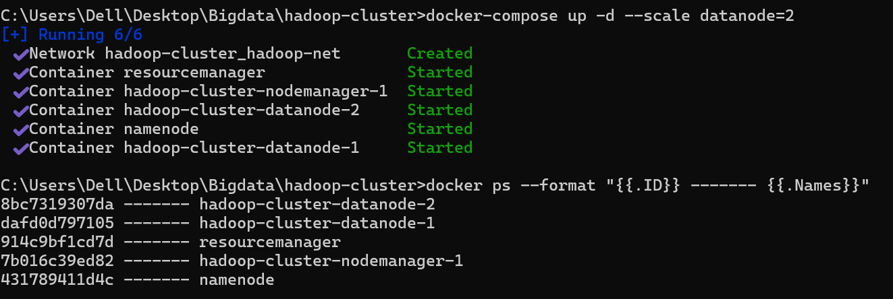


### import ventes.csv file


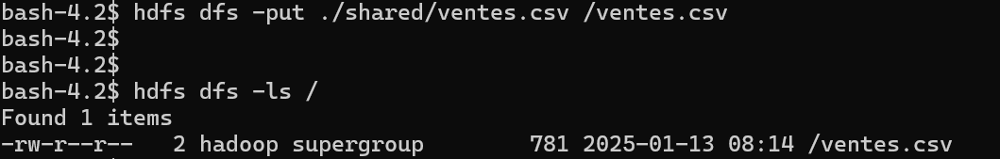

### Reading ventes.csv file content

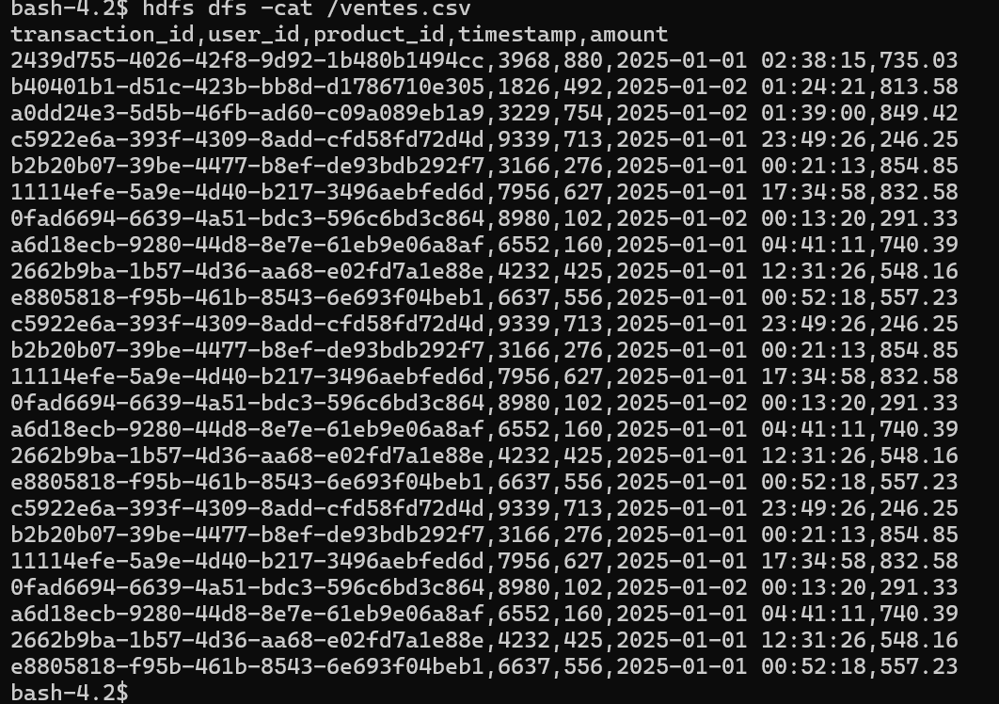

### Reading head of file

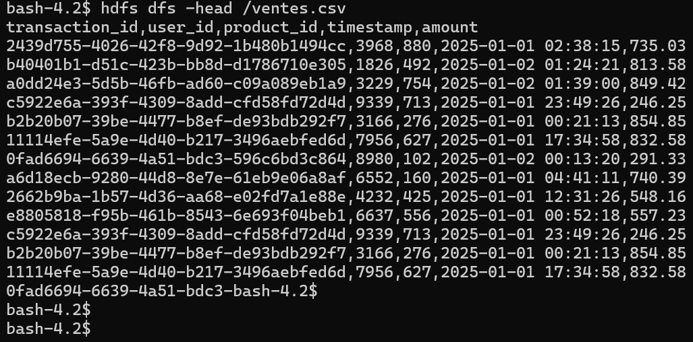

### Copy ventes.csv to /dest

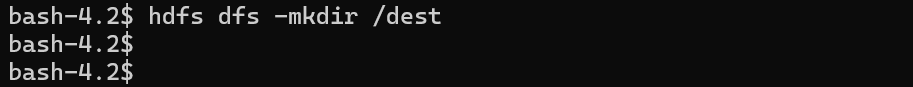
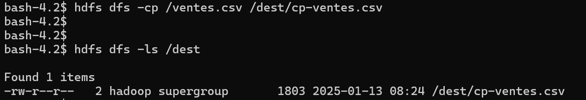
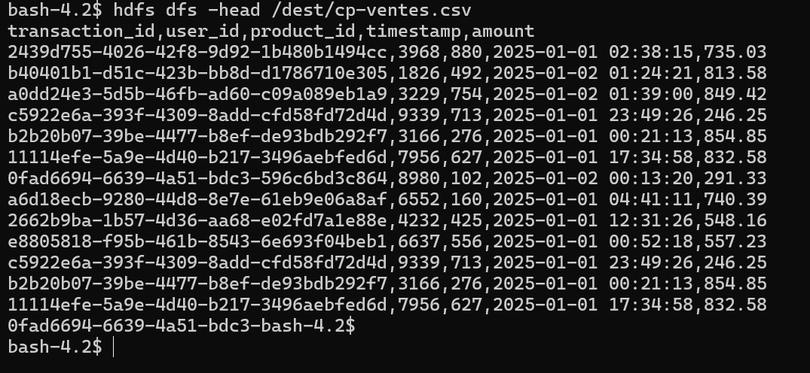


### update replication factor to 3


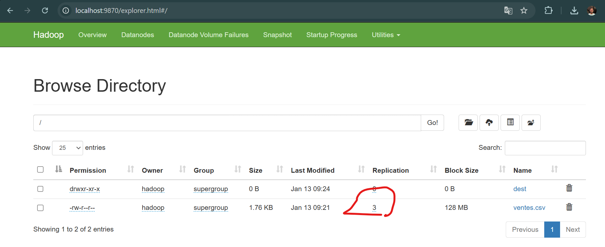


## Spring batch

### Application.yml file

```yaml
spring:
  application:
    name: spring-batch-ex

  datasource:
    url: jdbc:h2:mem:batchdb


  batch:
    jdbc:
      initialize-schema: always
  h2:
    console:
      enabled: true


```

### sales.csv file

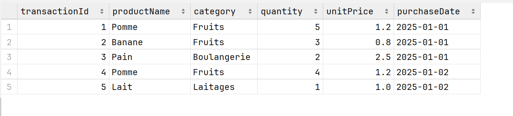


### Exercise 1

#### Models

```java
package md.hajji.springbatchex.models;


import jakarta.persistence.Entity;
import jakarta.persistence.Id;
import lombok.*;

import java.time.LocalDate;

@Entity
@Setter @Getter
@AllArgsConstructor @NoArgsConstructor @Builder
@ToString
public class Sale {

    @Id
    private Long transactionId;
    private String productName;
    private String category;
    private int quantity;
    private double unitPrice;
    private LocalDate purchaseDate;
    private double totalPrice;


    public Sale computeTotalPrice(){
        totalPrice = quantity * unitPrice;
        return this;
    }
}

```


#### Repositories

```java
package md.hajji.springbatchex.repositories;


import md.hajji.springbatchex.models.Sale;
import org.springframework.data.jpa.repository.JpaRepository;

public interface SaleRepository  extends JpaRepository<Sale, Long> {
}

```

#### Mappers


```java
package md.hajji.springbatchex.configurations;

import md.hajji.springbatchex.models.Sale;
import org.springframework.batch.item.file.LineMapper;
import org.springframework.batch.item.file.mapping.DefaultLineMapper;
import org.springframework.batch.item.file.mapping.FieldSetMapper;
import org.springframework.batch.item.file.transform.DelimitedLineTokenizer;
import org.springframework.batch.item.file.transform.LineTokenizer;
import org.springframework.context.annotation.Bean;
import org.springframework.stereotype.Service;

import java.time.LocalDate;
import java.time.format.DateTimeFormatter;

@Service
public class SaleMapper {

    private static final DateTimeFormatter FORMATTER =
            DateTimeFormatter.ofPattern("yyyy-MM-dd");

    @Bean
    public FieldSetMapper<Sale> saleFieldSetMapper(){
        return fieldSet -> Sale.builder()
                .transactionId(fieldSet.readLong(0))
                .productName(fieldSet.readString(1))
                .category(fieldSet.readString(2))
                .quantity(fieldSet.readInt(3))
                .unitPrice(fieldSet.readDouble(4))
                .purchaseDate(LocalDate.parse(fieldSet.readString(5), FORMATTER))
                .build();
    }


    @Bean
    public LineTokenizer lineTokenizer(){
        var tokenizer = new DelimitedLineTokenizer();
        tokenizer.setNames(new String[]{"transactionId", "productName", "category", "quantity", "unitPrice", "purchaseDate"});
        return tokenizer;
    }


    @Bean
    public LineMapper<Sale> saleLineMapper(
            LineTokenizer tokenizer,
            FieldSetMapper<Sale> saleFieldSetMapper){

        var defaultLineMapper = new DefaultLineMapper<Sale>();
        defaultLineMapper.setLineTokenizer(tokenizer);
        defaultLineMapper.setFieldSetMapper(saleFieldSetMapper);
        return defaultLineMapper;
    }
}

```


#### BatchConfiguration


```java
package md.hajji.springbatchex.configurations;


import jakarta.persistence.EntityManagerFactory;
import md.hajji.springbatchex.models.Sale;
import org.springframework.batch.core.Job;
import org.springframework.batch.core.JobParameters;
import org.springframework.batch.core.JobParametersBuilder;
import org.springframework.batch.core.Step;
import org.springframework.batch.core.job.builder.JobBuilder;
import org.springframework.batch.core.repository.JobRepository;
import org.springframework.batch.core.step.builder.StepBuilder;
import org.springframework.batch.item.ItemProcessor;
import org.springframework.batch.item.ItemReader;
import org.springframework.batch.item.ItemWriter;
import org.springframework.batch.item.database.JpaItemWriter;
import org.springframework.batch.item.database.builder.JpaItemWriterBuilder;
import org.springframework.batch.item.file.FlatFileItemReader;
import org.springframework.batch.item.file.LineMapper;
import org.springframework.batch.item.file.builder.FlatFileItemReaderBuilder;
import org.springframework.batch.item.function.FunctionItemProcessor;
import org.springframework.context.annotation.Bean;
import org.springframework.context.annotation.Configuration;
import org.springframework.core.io.ClassPathResource;
import org.springframework.transaction.PlatformTransactionManager;

@Configuration
public class BatchConfiguration {


    @Bean
    public FlatFileItemReader<Sale> reader(LineMapper<Sale> lineMapper){
        return new FlatFileItemReaderBuilder<Sale>()
                .name("sales-reader")
                .resource(new ClassPathResource("sales.csv"))
                .lineMapper(lineMapper)
                .linesToSkip(1)
                .build();
    }


    @Bean
    public ItemProcessor<Sale, Sale> processor(){
        return new FunctionItemProcessor<>(Sale::computeTotalPrice);
    }


    @Bean
    public JpaItemWriter<Sale> writer(EntityManagerFactory emf) {
        return  new JpaItemWriterBuilder<Sale>()
                .entityManagerFactory(emf)
                .build();
    }


    @Bean
    public Step totalPriceStep(
            ItemReader<Sale> reader,
            ItemProcessor<Sale, Sale> processor,
            ItemWriter<Sale> writer,
            JobRepository jobRepository,
            PlatformTransactionManager transactionManager
    ){
        return new StepBuilder("total-price-step", jobRepository)
                .<Sale, Sale>chunk(2, transactionManager)
                .reader(reader)
                .processor(processor)
                .writer(writer)
                .build();
    }


    @Bean
    public Job saleJob(
            JobRepository jobRepository,
            Step totalPriceStep
    ){
        return new JobBuilder("total-Price-Job", jobRepository)
                .start(totalPriceStep)
                .build();
    }


    @Bean
    public JobParameters jobParameters(){
        return new JobParametersBuilder()
                .addLong("startTime", System.currentTimeMillis())
                .toJobParameters();
    }


}

```


#### Launchers

````java
package md.hajji.springbatchex.launchers;


import lombok.RequiredArgsConstructor;
import lombok.SneakyThrows;
import org.springframework.batch.core.Job;
import org.springframework.batch.core.JobParameters;
import org.springframework.batch.core.JobParametersInvalidException;
import org.springframework.batch.core.launch.JobLauncher;
import org.springframework.batch.core.repository.JobExecutionAlreadyRunningException;
import org.springframework.batch.core.repository.JobInstanceAlreadyCompleteException;
import org.springframework.batch.core.repository.JobRestartException;
import org.springframework.boot.CommandLineRunner;
import org.springframework.context.annotation.Bean;
import org.springframework.stereotype.Service;

@Service
@RequiredArgsConstructor
public class SaleJobLauncher {

    private final JobLauncher jobLauncher;
    private final Job saleJob;
    private final JobParameters jobParameters;

    
    @Bean
    public CommandLineRunner launchSaleJob() {
        return args -> {
            jobLauncher.run(saleJob, jobParameters);
        };
    }
}

````


### Results

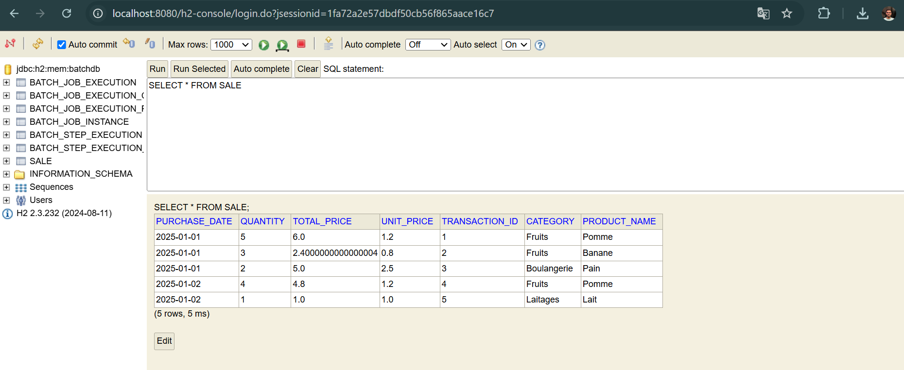


## Kakfka-streams

## docker-compose

```yaml

services:

  # zookeeper:
  zookeeper:
    image: confluentinc/cp-zookeeper:7.7.1
    container_name: zookeeper
    hostname: zookeeper
    environment:
      ZOOKEEPER_CLIENT_PORT: 2181
      ZOOKEEPER_TICK_TIME: 2000
    ports:
      - 22181:2181

    networks:
      - kafka-net
  
  # broker-1:
  broker-1:
    image: confluentinc/cp-kafka:7.7.1
    container_name: broker-1
    hostname: broker-1
    depends_on:
      - zookeeper
    ports:
      - 9091:29091
    environment:
      KAFKA_BROKER_ID: 0
      KAFKA_ZOOKEEPER_CONNECT: zookeeper:2181
      KAFKA_LISTENERS: INTERNAL://:8081,EXTERNAL_SAME_HOST://:29091
      KAFKA_ADVERTISED_LISTENERS: INTERNAL://broker-1:8081,EXTERNAL_SAME_HOST://localhost:9091
      KAFKA_LISTENER_SECURITY_PROTOCOL_MAP: INTERNAL:PLAINTEXT,EXTERNAL_SAME_HOST:PLAINTEXT
      KAFKA_INTER_BROKER_LISTENER_NAME: INTERNAL
      KAFKA_OFFSETS_TOPIC_REPLICATION_FACTOR: 2
      KAFKA_DEFAULT_REPLICATION_FACTOR: 2
      KAFKA_NUM_PARTITIONS: 3
    
    networks:
      - kafka-net

  

  broker-2:
    image: confluentinc/cp-kafka:7.7.1
    container_name: broker-2
    hostname: broker-2
    depends_on:
      - zookeeper
    ports:
      - 9092:29092
    environment:
      KAFKA_BROKER_ID: 1
      KAFKA_ZOOKEEPER_CONNECT: zookeeper:2181
      KAFKA_LISTENERS: INTERNAL://:8082,EXTERNAL_SAME_HOST://:29092
      KAFKA_ADVERTISED_LISTENERS: INTERNAL://broker-2:8082,EXTERNAL_SAME_HOST://localhost:9092
      KAFKA_LISTENER_SECURITY_PROTOCOL_MAP: INTERNAL:PLAINTEXT,EXTERNAL_SAME_HOST:PLAINTEXT
      KAFKA_INTER_BROKER_LISTENER_NAME: INTERNAL
      KAFKA_OFFSETS_TOPIC_REPLICATION_FACTOR: 2
      KAFKA_DEFAULT_REPLICATION_FACTOR: 2
      KAFKA_NUM_PARTITIONS: 3
    
    networks:
      - kafka-net


networks:
  kafka-net:
    driver: bridge
```


### Start kafka-cluster

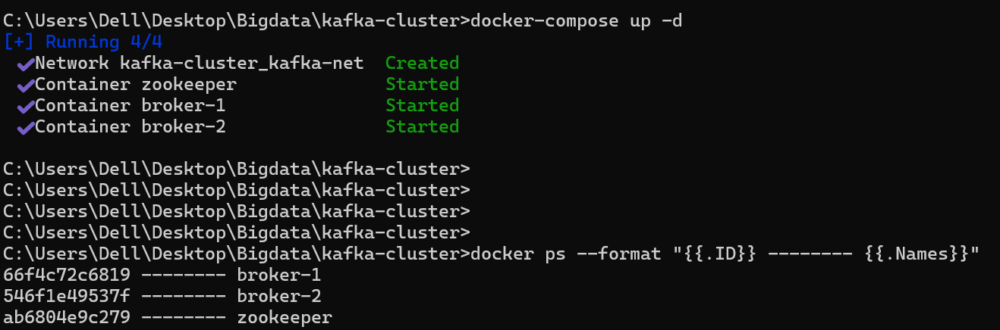


### Create vehicle-data and speed-alert topics

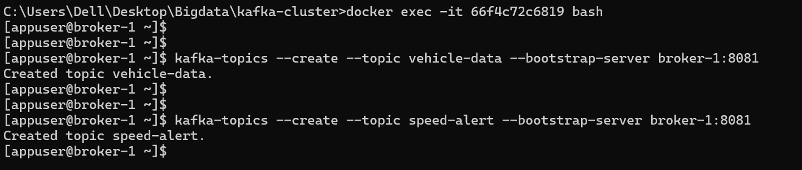


### dependencies

```xml
<dependencies>
    <dependency>
        <groupId>org.apache.kafka</groupId>
        <artifactId>kafka-streams</artifactId>
        <version>3.8.0</version>
    </dependency>

    <dependency>
        <groupId>org.slf4j</groupId>
        <artifactId>slf4j-api</artifactId>
        <version>2.0.16</version>
    </dependency>
    <dependency>
        <groupId>org.slf4j</groupId>
        <artifactId>slf4j-simple</artifactId>
        <version>2.0.16</version>
    </dependency>

    <!-- https://mvnrepository.com/artifact/com.fasterxml.jackson.core/jackson-databind -->
    <dependency>
        <groupId>com.fasterxml.jackson.core</groupId>
        <artifactId>jackson-databind</artifactId>
        <version>2.18.1</version>
    </dependency>

    <dependency>
        <groupId>org.projectlombok</groupId>
        <artifactId>lombok</artifactId>
        <version>1.18.34</version>
    </dependency>

</dependencies>
```


### Exercise1: Speed alerts


#### Speed record

```java
package md.hajji.models;

import java.time.LocalDateTime;

public record Speed(
        Long VID,
        int speed,
        double latitude,
        double longitude,
        double distanceToNextObstacle,
        LocalDateTime timestamp

) {


    public SpeedAlert alert(){
        return  new SpeedAlert(
                VID,
                speed,
                latitude,
                longitude,
                "Overspeeding",
                timestamp
        );
    }


    public ObstacleAlert obstacleAlert(){
        return  new ObstacleAlert(
                VID,
                distanceToNextObstacle,
                "Obstacle too close!"
        );
    }
}

```

#### SpeedAlert record

```java
package md.hajji.models;

import java.time.LocalDateTime;

public record SpeedAlert(
        Long VID,
        int speed,
        double latitude,
        double longitude,
        String raison,
        LocalDateTime timestamp
) {


    @Override
    public String toString() {
        return VID + "|" + speed + "|" + latitude + "|" + longitude + "|" + raison + "|" + timestamp;
    }
}

```


#### SpeedAlertStreams

```java
package md.hajji;

import md.hajji.Serdes.SpeedAlertSerde;
import md.hajji.models.Speed;
import org.apache.kafka.common.protocol.types.Field;
import org.apache.kafka.common.serialization.Serdes;
import org.apache.kafka.streams.KafkaStreams;
import org.apache.kafka.streams.StreamsBuilder;
import org.apache.kafka.streams.StreamsConfig;
import org.apache.kafka.streams.kstream.Consumed;
import org.apache.kafka.streams.kstream.Produced;

import java.time.LocalDateTime;
import java.time.format.DateTimeFormatter;
import java.util.Properties;

public class SpeedAlertStreams {


    static final String APPLICATION_ID = "SPEED_ALERT_STREAMS_APP";
    static final String INPUT_TOPIC = "vehicle-data";
    static final String OUTPUT_TOPIC = "speed-alert";
    static final DateTimeFormatter FORMATTER =
            DateTimeFormatter.ofPattern("yyyy-MM-dd HH:mm:ss");


    static Speed mapToSpeed(String line){
        String[] fields = line.split("\\|");
        return  new Speed(
                Long.parseLong(fields[0]),
                Integer.parseInt(fields[1]),
                Double.parseDouble(fields[2]),
                Double.parseDouble(fields[3]),
                Double.parseDouble(fields[4]),
                LocalDateTime.parse(fields[5], FORMATTER)
        );
    }

    public static void main(String[] args) {


        Properties props = new Properties();
        props.put(StreamsConfig.APPLICATION_ID_CONFIG, APPLICATION_ID);
        props.put(StreamsConfig.BOOTSTRAP_SERVERS_CONFIG, "localhost:9092");
        props.put(StreamsConfig.DEFAULT_KEY_SERDE_CLASS_CONFIG, Serdes.String().getClass());
        props.put(StreamsConfig.DEFAULT_VALUE_SERDE_CLASS_CONFIG, Serdes.String().getClass());


        StreamsBuilder builder = new StreamsBuilder();

        builder.stream(INPUT_TOPIC, Consumed.with(Serdes.String(), Serdes.String()))
                //convert to speed record:
                .mapValues(SpeedAlertStreams::mapToSpeed)
                // log and verify results:
                .peek((k, speed) -> System.out.println(speed))
                .filter((k, speed) -> speed.speed() > 80)
                .peek((k, speed) -> System.out.println(speed))
                .mapValues(speed -> speed.alert().toString())
                .to(OUTPUT_TOPIC, Produced.with(Serdes.String(), Serdes.String()));


        KafkaStreams streams = new KafkaStreams(builder.build(), props);
        streams.start();


        Runtime.getRuntime().addShutdownHook(new Thread(streams::close));


    }
}

```


#### Produce speed data into vehicle-data topic

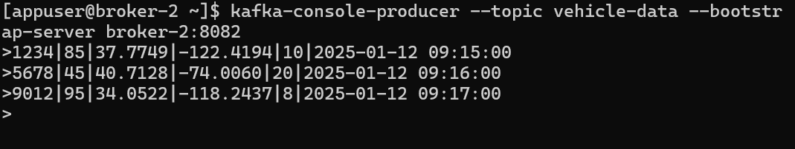


#### Consume speed records from speed-alert

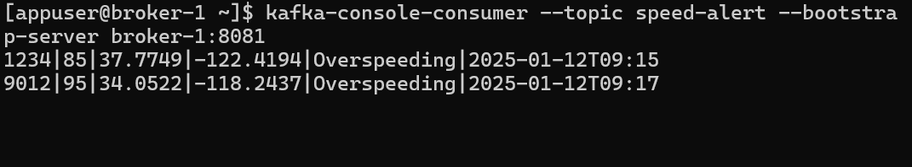


### Exercise 2: ObstacleAlertStreams


### ObstacleAlertStreams

```java
package md.hajji;

import md.hajji.models.Speed;
import org.apache.kafka.common.serialization.Serdes;
import org.apache.kafka.streams.KafkaStreams;
import org.apache.kafka.streams.StreamsBuilder;
import org.apache.kafka.streams.StreamsConfig;
import org.apache.kafka.streams.kstream.Consumed;
import org.apache.kafka.streams.kstream.Produced;

import java.time.LocalDateTime;
import java.time.format.DateTimeFormatter;
import java.util.Properties;

public class ObstacleAlertStreams {


    static final String APPLICATION_ID = "SPEED_ALERT_STREAMS_APP";
    static final String INPUT_TOPIC = "vehicle-data";
    static final String OUTPUT_TOPIC = "obstacle-alert";
    static final DateTimeFormatter FORMATTER =
            DateTimeFormatter.ofPattern("yyyy-MM-dd HH:mm:ss");


    static Speed mapToSpeed(String line){
        String[] fields = line.split("\\|");
        return  new Speed(
                Long.parseLong(fields[0]),
                Integer.parseInt(fields[1]),
                Double.parseDouble(fields[2]),
                Double.parseDouble(fields[3]),
                Double.parseDouble(fields[4]),
                LocalDateTime.parse(fields[5], FORMATTER)
        );
    }

    public static void main(String[] args) {


        Properties props = new Properties();
        props.put(StreamsConfig.APPLICATION_ID_CONFIG, APPLICATION_ID);
        props.put(StreamsConfig.BOOTSTRAP_SERVERS_CONFIG, "localhost:9092");
        props.put(StreamsConfig.DEFAULT_KEY_SERDE_CLASS_CONFIG, Serdes.String().getClass());
        props.put(StreamsConfig.DEFAULT_VALUE_SERDE_CLASS_CONFIG, Serdes.String().getClass());


        StreamsBuilder builder = new StreamsBuilder();

        builder.stream(INPUT_TOPIC, Consumed.with(Serdes.String(), Serdes.String()))
                // convert to Speed record:
                .mapValues(ObstacleAlertStreams::mapToSpeed)
                // log results:
                .peek((k, speed) -> System.out.println(speed))
                // keep only records with distanceToNextObstacle < 10:
                .filter((k, speed) -> speed.distanceToNextObstacle() < 10)
                // log results:
                .peek((k, speed) -> System.out.println(speed))
                // convert to string value:
                .mapValues(speed -> speed.obstacleAlert().toString())
                // save into obstacle topic:
                .to(OUTPUT_TOPIC, Produced.with(Serdes.String(), Serdes.String()));


        KafkaStreams streams = new KafkaStreams(builder.build(), props);
        streams.start();


        Runtime.getRuntime().addShutdownHook(new Thread(streams::close));


    }
}

```


#### Produce speed data into vehicle-data

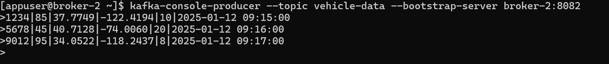

#### Obstacle alert

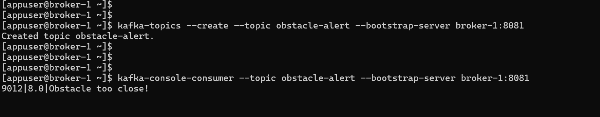


